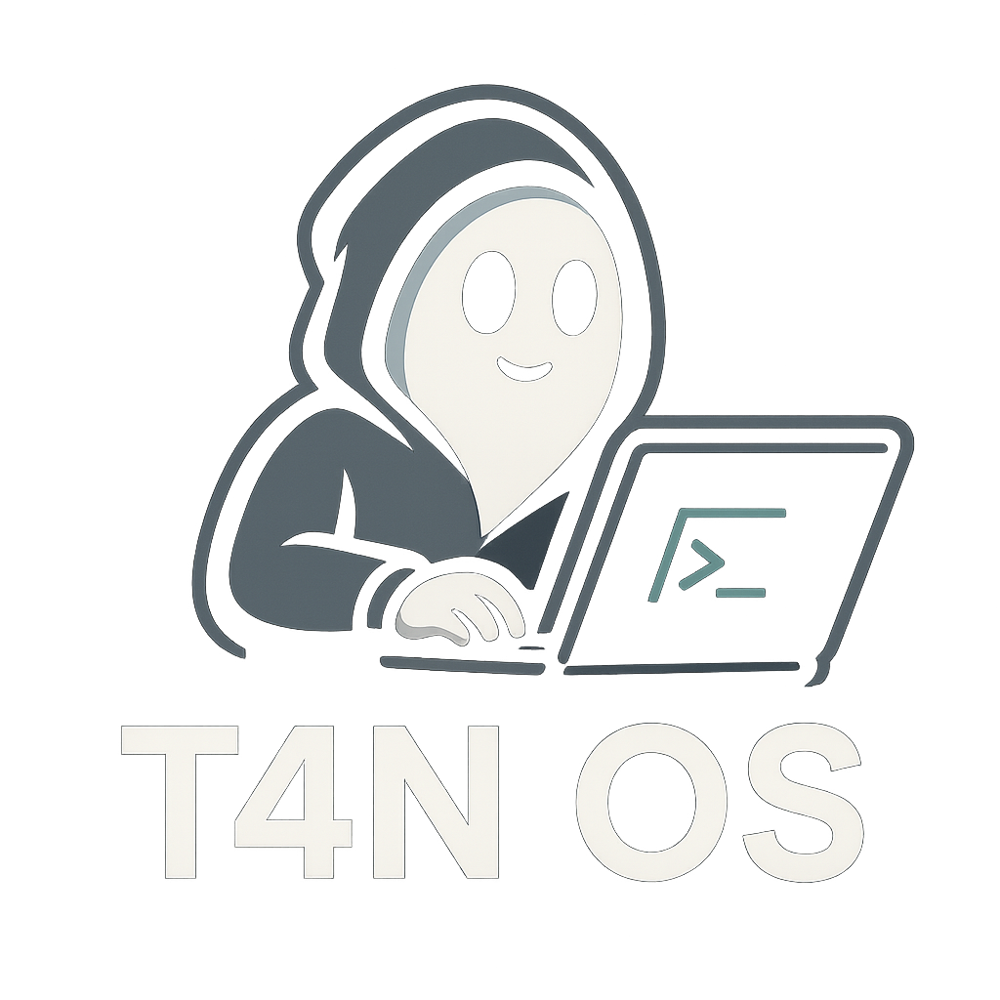

  

  <i>Linux Distribution based on <b>Void Linux</b></i>  

---

## ✨ Overview
**T4n OS** adalah distribusi Linux berbasis **Void Linux** dengan fokus pada:
- Kesederhanaan
- Kinerja ringan
- Penggunaan paket yang mudah melalui **xbps** dan **xbps-src**  
- Dilengkapi dengan **[T4n-Man](https://github.com/t4ngh0st/T4n-Man)** sebagai package manager wrapper.

---

## 📀 Editions
### 🖥️ XFCE

### ⚡ I3WM

### 🧩 BSPWM

### 🌌 Hyprland *(Coming Soon)*

---

## ⬇️ Download
- [Google Drive](mailto:akun@gmail.com)  
- [SourceForge](urldownload/t4nos)  

---

  Made with ❤️ by Gh0sT4n

